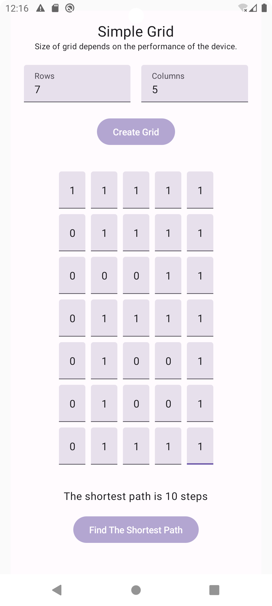

YTechAssignment Application
=============================

This is a YTechAssignment Android application that uses for the programming test : Path finding in a grid

## Building the Sample App

Clone the repo:
`git clone git@github.com:isymphonyz/YTechAssignment.git`

Environment:
* Android Studio : Jellyfish | 2023.3.1
* Android Gradle Plugin Version : 8.4.0
* Gradle Version : 8.6
* Compile SDK Version: 34
* Java Version : 1.8

## Screenshots

<p>
  
  
  
</p>

## Tech-Stack

* 100% Kotlin
* Compose - modern native UI
* ViewModel - store and manage UI-related data in a lifecycle-aware way

## Explanation of algorithm

In this application, I use BFS algorithm to find the shortest paths.

Checks if the grid is valid and if the start or end cell is an obstacle (0)
```kotlin
if (rows == 0 || cols == 0 || grid[0][0] == 0 || grid[rows - 1][cols - 1] == 0) {
    _shortestPathResult.value = "No path found"
    return
}
```

Define movement directions
```kotlin
val directions = listOf(
    Point(0, 1),  // right
    Point(0, -1), // left
    Point(1, 0),  // down
    Point(-1, 0)  // up
)
```

Use BFS algorithm to find the shortest paths. Start the queue with the top-left corner (0, 0) with a step count of 0. Keep track of visited cells. It is initialized with the same dimensions as the grid. Continues as long as there are elements in the queue. Iterates through each possible direction to the new position (newX, newY). If the queue is empty and the goal has not been reached, sets the shortest path result to "No path found". If the current cell is the bottom-right corner, sets the shortest path result to the number of steps.
```kotlin
val queue: MutableList<Pair<Point, Int>> = mutableListOf(Pair(Point(0, 0), 0))
val visited = Array(rows) { BooleanArray(cols) }
visited[0][0] = true

while (queue.isNotEmpty()) {
    val (current, steps) = queue.removeAt(0)

    // If the current cell is the bottom-right corner,
    // sets the shortest path result to the number of steps taken.
    if (current.x == rows - 1 && current.y == cols - 1) {
        _shortestPathResult.value = "The shortest path is $steps steps"
        return
    }

    for (direction in directions) {
        val newX = current.x + direction.x
        val newY = current.y + direction.y

        // Checks if the new position is within bounds, is not an obstacle and has not been visited.
        // If valid, adds the new position to the queue with an incremented step count.
        if (
            newX in 0 until rows &&
            newY in 0 until cols &&
            grid[newX][newY] == 1 &&
            !visited[newX][newY]
        ) {
            queue.add(Pair(Point(newX, newY), steps + 1))
        }
    }
}

_shortestPathResult.value = "No path found"
}
```